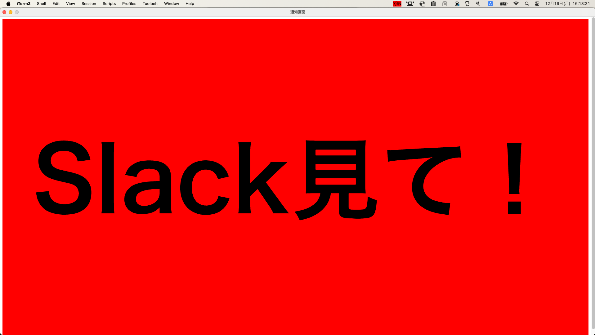

## これは何？

絶対に Slack の DM とメンションに気付くことができる Slack 通知ツールのプロトタイプです。

## 動作仕様

- 初回起動時に設定画面が開き、Slack OAuth Token を入力
  - [こちらの記事](https://qiita.com/kobayashi_ryo/items/a194e620b49edad27364)を参考に、Slack ワークスペースに Slack App を作成し、OAuth Token を取得してください。Scope は**search:read** です。
  - 設定画面はトレイアイコンのメニューから開くことができます
- 自分宛ての DM やメンションが来たら、全画面の通知ウインドウが表示される
- ウインドウが閉じると Slack で該当メッセージが表示される

## 事前準備

1. このリポジトリを clone
2. node.js 20 以降をインストール
3. npm ci を実行

## 実行方法

npm start を実行

## パッケージング方法

npm run build を実行すると xsn-darwin-arm64 のようなディレクトリに xsn.app が生成されます。
